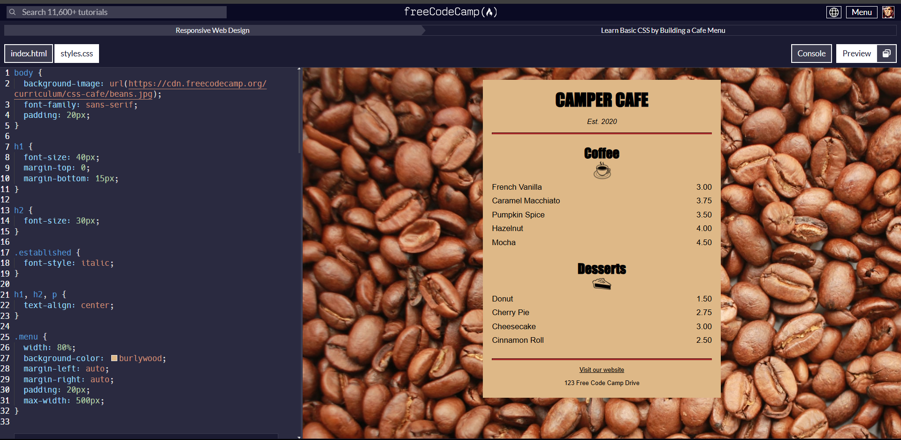

I have finished my study camp on <a href="https://www.freecodecamp.org/" style>FreeCodeCamp.org</a> 
and now, I have completed Learn Basics CSS by building a cafe menu <a href="https://github.com/freeCodeCamp/freeCodeCamp" style>#FreeCodeCamp</a>

